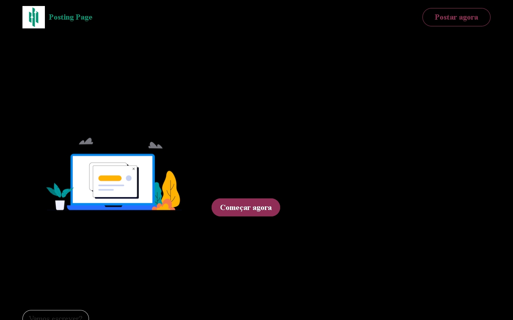

<h1 align="center">Viagens Landing Page</h1>

  
Segundo projeto da trilha 2 da plataforma <a href="https://app.devstart.tech">DEVstart</a>.

  <a href="#-tecnologias">Tecnologias</a>&nbsp;&nbsp;&nbsp;|&nbsp;&nbsp;&nbsp;
  <a href="#-projeto">Projeto</a>&nbsp;&nbsp;&nbsp;

  

## 🚀 Tecnologias

Esse projeto foi desenvolvido com as seguintes tecnologias:

- HTML e CSS
- JavaScript
- Responsividade para mobile e menu hamburguer
- Algumas tags semânticas
- Consumo de API

## 💻 Projeto

A **Posting Blog** é um projeto da plataforma [DEVStart](https://app.devstart.tech), onde precisei criar uma página web de postagem (um blog). O projeto não tem um design no figma, então utilizei o site [Mobirise](https://mobirise.com) para gerar um layout aleatório de blog para mim.

Nesse projeto, o foco era consumir a API [JSONPlaceholder](https://jsonplaceholder.typicode.com/) e renderizar no site. O objetivo era que o usuário digitasse no campo de formulário, enviasse para a API usando POST e fizesse a renderização na página, simulando um blog. Porém a API é apenas para testes e retorna apenas postagens com Lorem.

- [Acesse o projeto online](https://phdiias.github.io/posting--page/)